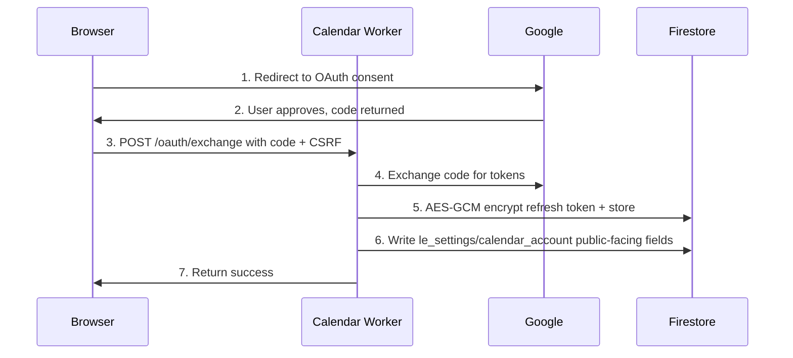

# Calendar and availability

The public free-consultation booking flow at [legaleaglelaws.com/book-consultation](https://legaleaglelaws.com/book-consultation) depends on two admin settings: the firm's connected Google Calendar account (so events can be created with Google Meet links) and the firm's availability rules (so the public flow shows only the right slots). Two admin pages handle these: **/admin/settings/google-calendar** for the OAuth connection and **/admin/settings/availability** for the slot rules and date blocks.

This page covers both, end to end, including the disconnect path and what happens when the connection fails. Both pages are admin-only.

## Why the firm needs a connected Google Calendar

Booking creates a real Google Calendar event with an auto-generated Google Meet link. Doing this needs a long-lived OAuth grant against an actual Google account — the firm's account. That account becomes the calendar of record for every booked consultation. Cancellations, reschedules, and Meet links all live on it.

The connection is one-time. Once an admin connects the calendar, every public booking lands on it for as long as the OAuth grant remains valid (years, in practice). Revoking from Google's side or disconnecting from the admin side is the only way to break it.

## Connecting the firm's Google Calendar

`/admin/settings/google-calendar` shows the current connection state. On a fresh install, the state is "Not connected" with a single **Connect Google Calendar** button. The flow:

Key points:

- **The connect button is admin-only.** The page reads the current admin's session; if you are not an admin, the page redirects you with a clear "not authorised" message.
- **CSRF protection** — the OAuth `state` parameter is a random uuid generated and stored in `sessionStorage` before the redirect. The worker verifies on return; mismatches return 400 and the user is invited to try again.
- **The refresh token is encrypted at rest** with AES-GCM using the platform's `LEGAL_EAGLE_TOKEN_ENCRYPTION_KEY` worker secret. The encrypted blob lives in `le_calendar_secrets/account`, which is deny-all on the client side. The Firebase Console can read it; nothing else can.
- **The public-facing connection info** — the connected Google account email, the calendar ID, the connected-at timestamp — lives in `le_settings/calendar_account` and is admin-readable so the admin page can show "Connected as `your-firm@gmail.com`" without exposing the token.

## Disconnecting

The same page shows a **Disconnect** button when a connection is active. Clicking it:

1. Calls the worker's `/oauth/revoke` endpoint.
2. The worker calls Google's `/revoke` with the firm's refresh token. Google's audit log reflects the revoke.
3. The encrypted secrets row is deleted.
4. `le_settings/calendar_account.connected = false`.
5. Future `/availability` and `/bookings` requests from the public flow return errors; the booking page automatically falls back to the legacy callback form at `/free-consultation`.

Disconnecting does **not** delete existing appointments. Past and future bookings remain in `le_appointments`; the `googleEventId` field still references the Google Calendar event, which is now orphaned (Google still has the event; we just can't touch it). Reconnect the same Google account to resume control.

## Availability — weekly rules

`/admin/settings/availability` is split into two panels: **Weekly template** (recurring rules) and **Blocked dates** (one-off exceptions).

The weekly template defines the firm's office hours by day of week and the slot duration / spacing. The defaults match the firm's stated office hours (Mon–Sat, 9 AM – 6 PM Pakistan time, 15-minute slots, 5-minute buffer between slots).

| Field | Meaning |
|---|---|
| **Day of week** | Mon, Tue, ..., Sun. Sundays default to off. |
| **Open** | Toggle for whether the day has any bookable slots. |
| **Window start / end** | Local-time bookable window. Slots only generate inside this window. |
| **Slot duration** | Per-slot length in minutes. Default 15 for free consultations. |
| **Buffer** | Minutes between slots, to give the lawyer breathing room. Default 5. |
| **Max bookings per day** | A soft cap (the firm can refuse extra bookings even if slots are technically available). |

Edits autosave. The public booking page subscribes via `onSnapshot`, so changes propagate within seconds — schedule-on-the-fly is fine.

## Blocked dates — one-off exceptions

Below the weekly template is a date list. Each blocked date carries a reason (court holiday, personal day, travel, conference) and an all-day / partial flag:

| Block type | Effect |
|---|---|
| All-day block | The day shows zero slots regardless of the weekly template. |
| Partial block (with window) | Slots outside the blocked window remain; slots inside disappear. |

Blocks live in `le_calendar_availability/blocks/dates/{YYYY-MM-DD}`. Adding one is a small form; removing is one click. The public booking page consumes both the weekly template and the block list in real time when computing available slots.

A common pattern: at the start of each month, add the public holidays for that month as blocks (the platform does not auto-import a holiday calendar in v1). When the firm closes for a conference, add the conference dates. When a hearing day runs over and lunch shifts, add a partial block for that one day.

## How the public booking page consumes this

When a visitor opens `/book-consultation`:

1. The page fetches `le_settings/calendar_account` to confirm the firm is connected.
2. If connected, the page fetches the weekly template and the next 30 days of blocks.
3. It computes "candidate slots" — every slot the template would generate, minus blocks.
4. It calls the calendar worker's `/availability?from=...&to=...` endpoint, which checks the firm's Google Calendar for existing events in the candidate slots and returns the truly available slots.
5. The page renders only the truly available slots.

If step 4 fails (worker down, Google API throttled), the page degrades gracefully — falls back to the legacy callback form at `/free-consultation` with an explanation banner.

## Booking rate limits

Two per-day rate limits live alongside availability:

| Limit | Default | Why |
|---|---|---|
| Availability checks per identity per day | 100 | Browsing the booking page repeatedly is fine; bots cannot use it to scrape the firm's schedule indefinitely. |
| Bookings per identity per day | 3 | Calendar spam protection. Admins are exempt. |

Both reset at UTC 00:00. The defaults can be edited at `/admin/settings/availability` → *Limits*. Setting a limit too low frustrates real users; too high invites abuse. The defaults have worked across pilot months.

## Use cases

### First-time connection during firm onboarding

An admin signs in. Goes to `/admin/settings/google-calendar`. Clicks Connect. Picks the firm's Google account (`info@legaleaglelaws.com`, perhaps). Approves the consent screen. Returns to a "Connected" state. Goes to `/admin/settings/availability`. Confirms the default weekly template matches the firm's actual hours. Sets a couple of upcoming public holidays as all-day blocks. Tests the public flow at `/book-consultation` from a separate tab.

### Adjusting hours for Ramadan

Open the weekly template. Trim each weekday's window-end from 6 PM to 4 PM for the duration of the month. Add the Eid holidays as all-day blocks. Restore the original hours at month-end.

### Travelling for a week

Add an all-day block for each of the seven days. Public booking shows zero slots; the page nudges the visitor to send a message via the contact form instead.

### A surprise hearing runs over

You realise the 2 PM slot needs to disappear. Add a partial block for today, blocking 1:30 PM – 3 PM. The 2 PM slot vanishes from the public flow within seconds.

### Disconnecting before changing the firm's Google account

The firm switches from `info@legaleaglelaws.com` to `bookings@legaleaglelaws.com`. From `/admin/settings/google-calendar`: Disconnect → Connect Google Calendar → pick the new account → approve. Existing bookings still reference the old calendar; new bookings land on the new one.

## Limitations

- **One Google Calendar account.** The firm has one bookable calendar; the platform does not support multi-account round-robin in v1.
- **No timezone per-day.** The entire weekly template is in one timezone, the firm's office timezone, set in `/admin/settings/site`. Visiting clients booking from elsewhere see times in their browser timezone but the calendar runs in the firm's.
- **Holidays are manual.** The platform doesn't auto-import Pakistan public holidays; the admin adds blocks.
- **No per-staff availability** in v1. The booking page is one calendar — the firm's. Per-attorney slots are roadmap.
- **No SMS reminders.** Google Calendar's own reminders fire to the firm's account; the platform does not send additional reminders.
- **Disconnect leaves orphaned Google events** in the firm's calendar. They are real events Google still shows; they are just no longer editable through our worker.

## Frequently asked questions

### What if the Google Calendar connection breaks mid-week?

The worker detects the broken connection on the next API call (Google returns 401). It marks the secrets row revoked and the user-facing connection flag false. The admin page surfaces a clear "reconnect required" banner. Public bookings fall back to the legacy form until reconnection.

### Can I have different hours on different weeks?

Not in v1. The weekly template is static; per-week variation is achieved through blocks. A truly different schedule for a few weeks requires editing the template (and editing it back).

### What permissions does the firm's Google account need?

`calendar.events` scope — read events, create events, attach Meet conference data. The worker does not request `calendar` (which would expose calendar settings) or any non-Calendar scope.

### Does the firm see the visitor's profile or contact info in the Google Calendar invite?

Yes — the platform passes the visitor's name and email so Google's invite reaches them. The firm sees the standard Google Calendar invitee fields on the event.

### Can I cancel a booked appointment from the admin panel?

`/admin/appointments` is the dedicated module for this. Open the appointment → Cancel. The worker deletes the Google Calendar event and updates our database. The visitor sees the cancellation when they next open their dashboard.

### What happens if the firm's Google Workspace admin enforces 2-Step Verification?

OAuth handles 2SV inline at consent time. App passwords are not needed.

### How long does the OAuth grant last?

Google refresh tokens are effectively indefinite — they last until explicitly revoked by either side or until the Google account's password is changed (which voids existing tokens). In normal operation, expect the connection to remain valid for years.

### Can I pre-test the public flow without exposing it?

Yes — go to `/book-consultation` while signed in as an admin. Admins bypass rate limits and can book test slots. To cancel test bookings, use `/admin/appointments`.

## Related pages

- [Admin overview](./intro.md) — sidebar map.
- [Free consultation booking (visitor-facing)](../user-guide/visitors/free-consultation-booking.md) — what the public flow looks like.
- [Appointments (firm-client view)](../user-guide/clients/appointments.md) — how booked clients see their own consultations.

## Author

Calendar worker, availability service, and this documentation built by **[Ahsan Mahmood](https://aoneahsan.com)**.
