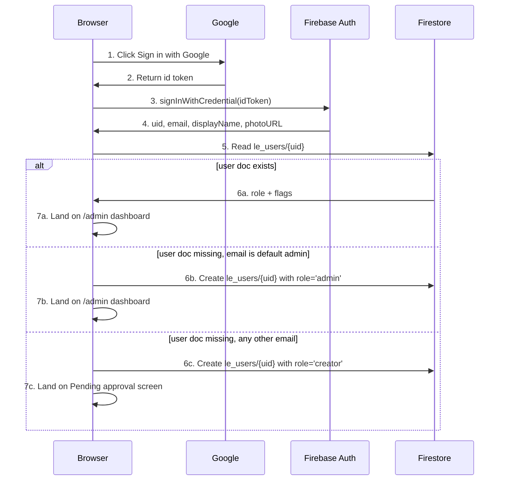

# Sign-in and RBAC

Authentication and authorisation for the admin panel are two distinct mechanisms. **Authentication** answers *"who are you?"* — handled by Google Sign-In via Firebase Auth. **Authorisation** answers *"what may you do?"* — handled by a four-tier role hierarchy, optionally narrowed by per-account *feature permissions*. The two stack: you can never reach a control you are not authorised for, regardless of whether the URL is bookmarked or guessed.

This page covers both layers, the per-module permission matrix, and how the database enforces what the UI promises.

## Authentication: Google Sign-In only

The platform supports exactly one identity provider: **Google**. There is no password field, no magic-link email, no SMS code, no SSO-from-corporate-IdP option in v1. This is a deliberate choice:

- Most prospective firm staff already have a Google account. The friction is zero.
- Google handles 2-Step Verification, hardware keys, and account-recovery flows better than we could build in-house.
- A single provider means a smaller attack surface — no password database to leak, no "forgot password" email flow to phish.
- The platform inherits Google's revocation: if a staff member's Google account is suspended or compromised, their access to `/admin` is severed the moment Google revokes the session.

Sign-in is implemented with Firebase Auth's `signInWithPopup` on web. On the Capacitor mobile build, the Google Auth plugin path (`@codetrix-studio/capacitor-google-auth`) opens the native Google chooser; the resulting Firebase ID token is the same shape as the web flow.

## The first-login flow



The default admin email is `aoneahsan@gmail.com` — the technical owner of the platform. **Only that email** is permitted by the database rules to create their own `le_users` document with `role: 'admin'`. Any other email attempting to write `role: 'admin'` on its own document is rejected at the rules layer regardless of what the UI does. This is the only point where the firstlogin flow is special-cased; every subsequent admin is granted manually by an existing admin from `/admin/users`.

A newly-created **creator** sees a friendly "pending approval" screen with a Sign out button, the firm's contact email, and an explanation that an admin needs to upgrade their account. The pending account is harmless — it has zero permissions until promoted.

## Session state

Sign-in state lives in a Zustand store (`src/stores/authStore.ts`) holding `{ user, role, status }`. It is persisted via `@capacitor/preferences` on native and `localStorage` on web. Firebase Auth's `onAuthStateChanged` keeps the store in sync with the underlying session; if Google revokes the session, the store flips to signed-out within seconds.

Closing the browser tab does not sign you out — Firebase Auth's refresh tokens keep the session alive across tabs and reloads. To sign out everywhere, use the **Sign out** menu in the admin top bar; this revokes the local session and any cached preferences.

## The four roles

| Role | Numeric order | What they can do |
|---|---|---|
| **admin** | 4 | Everything, including user/role management |
| **manager** | 3 | Everything except user/role management |
| **editor** | 2 | CRUD on most content; moderate comments; cannot edit settings or users |
| **creator** | 1 | Create blog drafts; edit own drafts; read-only elsewhere |

Roles are stored as the string `role` field on `le_users/{uid}`. The numeric ordering above lives in `src/lib/rbac.ts` as `ORDER: Record<Role, number>` so the platform can express "at least manager" as `atLeast(role, 'manager')` without any if-else trees.

## The per-module permission matrix

| Module | admin | manager | editor | creator |
|---|---|---|---|---|
| Users + roles | CRUD | — | — | — |
| Settings (site / seo / menus / chatbot) | CRUD | Read | Read | Read |
| Practice areas / team / case studies / landmark cases | CRUD | CRUD | CRU (no delete) | — |
| Blogs | CRUD + publish | CRUD + publish | CRU own/all + publish | Create drafts (own) only |
| Blog comments moderation | approve + delete | approve + delete | approve only | — |
| Appointments / contact messages / help requests | CRUD | CRUD | Read | — |
| Testimonials / sliders / features / gallery | CRUD | CRUD | CRU | — |
| Subscribers | Read + export + delete | Read | — | — |
| Chatbot knowledge | CRUD | CRUD | CRU | — |
| Plans | CRUD | Read | — | — |
| Court-sync admin dashboard | Read | Read | — | — |
| Analytics dashboards | Read | Read | — | — |

CRUD = Create + Read + Update + Delete. CRU = Create + Read + Update (no delete). A dash means no access at all — the sidebar entry is hidden, the URL returns a "not authorised" screen.

## Feature permissions

Some operations need finer granularity than role alone provides. The platform's *feature permission* system layers on top of roles:

- Every role gets a baseline set of features automatically (admin gets every feature implicitly).
- Per-account **opt-ins** can grant a feature to an account whose role does not normally include it.
- Per-account **opt-outs** can withdraw a feature from an account whose role normally includes it.

Examples of feature flags currently in use:

| Feature flag | Default for | Use case |
|---|---|---|
| `legal-persons-unmasked` | admin only | A firm client account needs unmasked phone/CNIC for a specific matter. |
| `legal-persons-export` | admin only | A specific account needs CSV export of directory searches. |
| `consultation-booking-admin` | manager+ | A particular staffer can book consultations on behalf of others. |

Granting and revoking feature permissions happens at `/admin/settings/feature-permissions`. The page lists every registered feature, who has it (by account email), and a typeahead-add picker for granting it to new accounts. See [plan and user management](./plan-and-user-management.md) for the details.

## Defence-in-depth: UI gates and Firestore rules

The platform enforces RBAC at two layers, both essential.

### Layer 1: UI gates

Every admin route and every action button is wrapped in a guard that checks `atLeast(currentRole, requiredRole)` or `hasFeature(currentUid, featureName)`. The guard is invisible — it hides controls you cannot use, redirects you away from URLs you cannot access, and renders a clear "not authorised" screen when you arrive somewhere you shouldn't.

The UI gate is a courtesy. It does not protect the database. A motivated user could bypass the UI entirely (open browser devtools, call the Firestore SDK directly with their own ID token). That's where Layer 2 takes over.

### Layer 2: Firestore security rules

`firestore.rules` is the binding authority. Every read and write to any `le_*` collection passes through rules that check the requesting user's role, ownership, and feature permissions. The rules are deployed via `firebase deploy --only firestore:rules`.

A sample rule for the blog collection:

```firestore
function isAtLeast(role) {
  let user = get(/databases/$(database)/documents/le_users/$(request.auth.uid)).data;
  return request.auth != null
    && user.active == true
    && (user.role == 'admin'
        || (role == 'manager' && user.role == 'manager')
        || (role == 'editor' && user.role in ['manager', 'editor'])
        || (role == 'creator' && user.role in ['manager', 'editor', 'creator']));
}

match /le_blogs/{blogId} {
  allow read: if true;                                  // public
  allow create: if isAtLeast('creator');
  allow update: if isAtLeast('editor')
                || (isAtLeast('creator')
                    && resource.data.authorUid == request.auth.uid
                    && resource.data.status == 'draft');
  allow delete: if isAtLeast('manager');
}
```

A creator can only update their own draft. An editor can update anyone's draft and can publish. A manager can delete. A non-signed-in visitor can read but never write. Even if the UI is bypassed, these constraints hold.

## How to promote a user

1. Sign in as an **admin**.
2. Go to `/admin/users`.
3. Find the account in the list (search by email or display name).
4. Open the detail drawer.
5. Change **Role** to the new tier.
6. Save. The change is visible to the affected user on their next page load.

You can also deactivate an account from the same drawer. Deactivated accounts retain their data but cannot sign in — the rules check `user.active == true` before granting any permission.

## Use cases

### Onboarding a new staff member

Have them sign in with their Google account first; they will land on the pending-approval screen. From `/admin/users`, find their auto-created creator account, change their role to editor (or whatever fits), save. They reload and have access.

### Suspending a departed staff member

`/admin/users` → find the account → set `active = false`. Their next page load returns the not-authorised screen. The account is not deleted; reactivation later restores their previous role and history.

### Temporarily expanding an editor's access

Grant them the specific feature permission they need (for example, `consultation-booking-admin`) rather than upgrading their whole role. When the temporary need ends, revoke the feature.

### Recovering admin access if `aoneahsan@gmail.com` is unavailable

Only the default admin email is permitted to self-promote. If that email is locked out, the recovery path is to change the default-admin email in `src/services/auth/createUserDoc.ts` (and the corresponding Firestore rule) and redeploy. This is a developer-side operation; it cannot be done from the admin UI.

### Auditing who did what

Every meaningful change writes `updatedBy` and `updatedAt` on the document. The full audit-log page is roadmap, but the per-document trail is already available — open any record in `/admin` and the modification history shows in the footer of the detail drawer.

## Limitations

- **One identity provider** (Google) — corporate SSO via SAML or OpenID Connect is not in v1.
- **Roles are platform-wide**, not per-module. An editor on blogs is also an editor on team profiles.
- **No time-bound role grants.** A promotion is until-revoked; the platform does not auto-revert after a duration.
- **No per-IP allowlisting** of admin sign-ins.
- **The audit-log page is incomplete** — per-document `updatedBy` exists, but a cross-collection timeline is roadmap.
- **No bulk role changes.** Each promote/demote is one user at a time.

## Frequently asked questions

### Can I use a non-Google email to access /admin?

No. v1 supports Google Sign-In only. If you have a custom-domain email, configure it through Google Workspace; you'll sign in with `you@yourfirm.com` and Google Workspace handles the provider side.

### What happens if Firebase Auth is down?

Existing sessions continue (refresh tokens are valid for ~1 hour). New sign-ins fail until Firebase Auth recovers. The platform shows a clear banner on `/admin/login` when Firebase Auth's status page reports issues.

### Can the default admin email be changed?

Yes, but it's a developer-side change (constant in source code plus a Firestore rule), not a UI toggle. Change it before opening sign-up to the public, and audit existing admin accounts at the same time.

### Can I have two default admins?

The "default admin auto-promote" path is for first-installation only. After bootstrap, additional admins are created the normal way: they sign in as creator, an existing admin promotes them. No need for a second auto-promote email.

### Where exactly is the role stored?

In Firestore at `le_users/{uid}.role`. Editing that document in the Firebase Console manually would change a role — but every legitimate change goes through `/admin/users`, which writes `updatedBy` and `updatedAt`. Direct console edits are visible as gaps in the audit trail.

### What about Firestore rules edge cases when a user's document doesn't exist yet?

The rules fall through to deny-by-default on any read or write requiring a role check. A user without a document cannot read or write anything beyond a few explicitly-public collections.

### Why are SaaS lawyers and firm staff on the same auth?

Same Google Sign-In, same `le_users` collection, but different fields. A SaaS lawyer has `plan = 'pro'` and no admin `role`; a firm staffer has `role = 'editor'` and no `plan`. The platform's surfaces check the relevant field for the relevant route.

## Related pages

- [Admin overview](./intro.md) — sidebar map and navigation.
- [Plan and user management](./plan-and-user-management.md) — the `/admin/users` page in detail.
- [Sign-in for firm clients](../user-guide/clients/dashboard-overview.md#how-to-sign-in) — what the client side looks like.
- [Sign-in gate (SaaS lawyer)](../user-guide/lawyers/getting-started.md#how-sign-up-works) — what lawyers see.

## Author

Auth flow, role system, and this documentation built by **[Ahsan Mahmood](https://aoneahsan.com)**.
