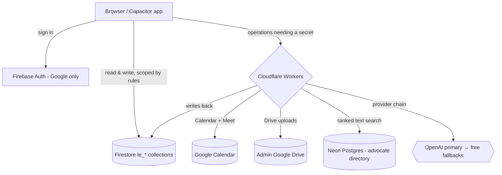

# Data flow

A request in the Legal Eagle platform takes one of two paths: a direct browser-to-Firestore read or write guarded by security rules, or a call to a Cloudflare Worker when the operation needs a server-side secret. The browser never holds a Google OAuth refresh token, an LLM API key, a payment-gateway secret, or a Neon Postgres credential — every one of those sits behind a worker. This page traces the common flows and names the trust boundaries so the security posture is legible without exposing internal endpoints.

## The two paths

Direct Firestore access covers the data where realtime sync and ownership are the point: a client's cases and hearings, appointments, help requests, profile and theme preferences, and the chatbot cache. Firestore security rules do the enforcement — a client reads only their own documents, a lawyer reads only their firm's records, and role promotion is blocked at the rules layer so no account can elevate itself to admin.

Worker-mediated access covers everything that would leak a secret if done from the browser. Booking a consultation calls the calendar worker, which authenticates as the firm's own Google account and creates a real Calendar event with a Meet link; the refresh token is encrypted at rest and never reaches the client. Admin image uploads call the Drive worker, which streams the file into the firm's shared Google Drive. Advocate-directory searches call the legal-persons worker, which runs parameterised Neon queries and masks fields by the caller's tier. AI questions call the chatbot worker, which runs the provider chain described below.

## The chat answer pipeline

A chatbot question does not go straight to a language model. It walks a six-tier pipeline and stops at the first tier that produces an answer, which keeps most questions free and fast:

1. A local IndexedDB exact-match lookup (instant, on-device).
2. A Firestore exact-hash cache keyed on the normalised question.
3. A Firestore fuzzy match against previously reviewed answers.
4. A curated knowledge base of vetted legal Q&A.
5. A local IndexedDB fuzzy match.
6. The worker's language-model chain — reached only when the first five tiers are empty.

Tier six runs an admin-ordered provider chain: OpenAI as the primary, then free fallbacks (Cloudflare Workers AI, Gemini free, Groq free) and paid fallbacks. OpenAI is skipped automatically when a configurable daily cost cap is reached or a kill switch is set, at which point the free providers serve. Every generative answer is written to an immutable training-capture collection with the prompt, response, token usage, cost, and latency, PII-redacted and tagged with the user's consent state. Cache-served answers are logged separately. Thumbs-up / thumbs-down feedback patches the stored record.

## Trust boundaries

The first boundary is Firebase Auth: sign-in is Google-only, and the first login from the owner's address provisions the single admin account. The second boundary is Firestore security rules, which scope every read and write to the authenticated user's role and ownership. The third boundary is each Cloudflare Worker: the worker is the only holder of the secret it guards, applies its own per-IP or per-user rate limits in Firestore, and audience-masks the data it returns. A browser that bypassed the app UI still could not read another user's documents or reach a worker's secret, because the enforcement lives at the rules and worker layers, not in the client.

## What this flow does NOT do

The platform does not sync data for offline use. There is no IndexedDB mirror of cases, contacts, or notes, no service-worker API cache, and no persistent offline write queue — the contract is online-required, and an offline mirror was explicitly ruled out. What looks like caching is narrow: the chat pipeline's on-device exact/fuzzy tiers, Firestore's default in-memory cache for the current session, and user preferences stored in Capacitor Preferences. Server data is always fetched live with a loading state. The platform also does not mirror a dataset across Firestore and Neon; each dataset has exactly one home.

## FAQ

**Does the browser ever hold a Google or AI secret?** No. OAuth refresh tokens, LLM keys, payment secrets, and Neon credentials live only inside Cloudflare Workers.

**Why does the chatbot have six tiers before the AI model?** To answer common questions from cache or a curated knowledge base, which is faster and free, and to reserve the paid model for genuinely new questions.

**What happens when the AI daily cost cap is hit?** OpenAI is skipped and the free provider fallbacks serve answers; the kill switch has the same effect on demand.

**Can a user's data be read by another user?** Firestore security rules scope every document to its owner and role, so no — enforcement is server-side, not in the UI.

## Author

Platform, SaaS, and documentation built by **[Ahsan Mahmood](https://aoneahsan.com)**. The firm and its legal practice belong to *Advocate Maaz Ahmed Warriach*.
