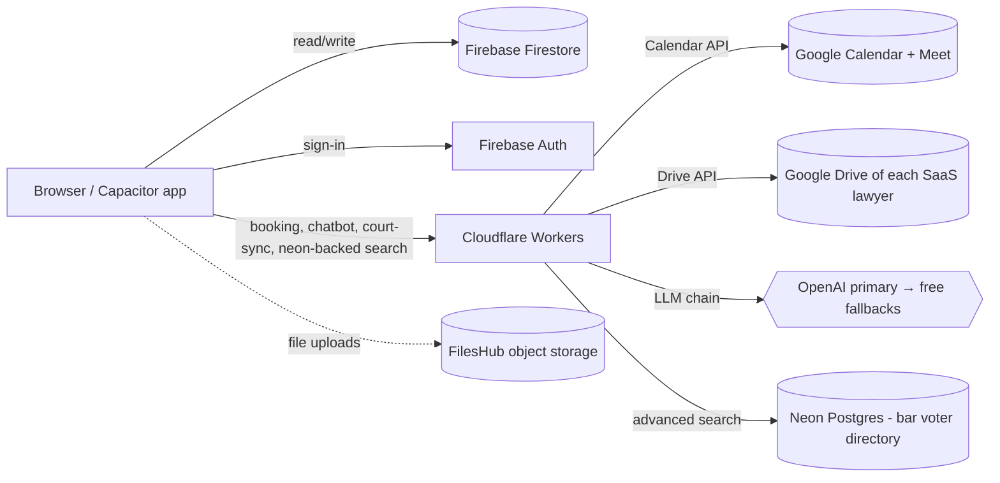

# Architecture — overview

The Legal Eagle platform is a single React application that ships to the web (Firebase Hosting) and to Android and iOS (Capacitor). It uses Firebase Firestore for most domain data, Cloudflare Workers for anything that needs server-side secrets, and Neon Postgres for one specific dataset (the bar voter directory) where ranked text search matters more than realtime sync. This page is the high-level orientation; the deeper pages — [Stack overview](./stack-overview.md), [Data flow](./data-flow.md), [Theme system](./theme-system.md), [Mobile build](./mobile-build.md), and [SEO & AEO posture](./seo-posture.md) — go further on each layer.

This documentation deliberately avoids leaking internal endpoints, secret names, and Firestore collection paths. The application source is in a private repository. What you see here is the **credibility-and-orientation** view — enough to evaluate the platform's posture, not enough to weaponise.

## The big picture

A few design rules drive this layout:

1. **Browser-direct to Firestore** for any data where realtime sync and document writes are the primary access pattern (cases, appointments, help requests, user profiles, chatbot cache). Security rules enforce ownership.
2. **Cloudflare Workers** sit between the browser and any service that requires a server-side secret (Google APIs, LLM providers, Neon Postgres credentials). The browser never sees these secrets.
3. **Firebase Hosting** for the SPA. Static HTML is generated at build time; AI crawlers see the same content as users.
4. **No Firebase Storage, no Firebase Functions.** File uploads go to FilesHub (a third-party object store the platform uses). Server-side compute lives on Cloudflare Workers (free tier).
5. **One source of truth per dataset.** The bar voter directory is on Neon (because it's a search-heavy 15 700-row read-mostly dataset where ranked text matters). Everything else is on Firestore. We do not mirror datasets across stores.

## Key choices and why

### React + TypeScript + Vite

A standard-issue modern stack. Vite gives sub-second HMR, TypeScript gives compile-time confidence, and React 19 is the rendering layer. No SSR — the platform is a pure SPA, with build-time static HTML emitted for SEO.

### Radix UI + Tailwind

Radix primitives for accessible, composable interactions; Tailwind v4 for utility classes. The brand layer is a set of design tokens (navy, gold, cream) wired into Radix Themes. The user-facing **theme customiser** lets every visitor pick appearance, accent, gray tone, radius, scaling, font size, and panel style — see [Profile and preferences](../user-guide/clients/profile-and-preferences.md).

### Capacitor for mobile

The same React app builds to Android and iOS via Capacitor 8. Native-only features (push, deep links, location, file picker) go through Capacitor plugins. The mobile build shares the web build's code, theme, and Firestore access; it is not a separate codebase.

### Firestore for domain data

Firestore gives:

- Realtime sync to clients (no polling for case updates or help-request replies).
- Document-level security rules (each user sees only their own documents).
- Free tier comfortable for the firm's traffic profile.

The platform uses a project prefix (`le_`) on every collection because the underlying Firebase project is shared across multiple of Ahsan's projects. Prefixing keeps collections cleanly namespaced.

### Cloudflare Workers for trusted operations

Three workers are in play:

- **Calendar worker** — handles consultation booking. Authenticates as the firm's Google Calendar account, creates events, attaches Meet links, encrypts the refresh token at rest with AES-256.
- **Chatbot worker** — runs the six-tier answer pipeline, manages the LLM provider chain (OpenAI primary, then free fallbacks: Cloudflare Workers AI → Gemini free → Groq free, then paid fallbacks), skips the paid provider when a daily cost cap or kill switch is hit, and enforces rate limits in Firestore. See [Data flow](./data-flow.md) for the full pipeline.
- **Legal persons worker** — fronts Neon Postgres for the bar voter directory. Uses parameterised queries, applies audience-aware masking, enforces per-IP rate limits.

Each worker has a project-prefixed name (`legaleagle-*`) so it does not collide with other Cloudflare projects on the same account.

### Neon Postgres for advanced search

The bar voter directory needs ranked text search across roughly 15 700 rows. Firestore is great at indexed equality and prefix queries; it is not good at ranked text. We use Neon's free tier for this single dataset:

- Singapore region (closest to Pakistani users).
- Two roles: `neondb_owner` (local-only, used for migrations) and `legaleagle_app` (read-only, used by the worker).
- All SQL flows through `@neondatabase/serverless` tagged templates — no string concatenation, no `.unsafe()`.
- The browser never sees Neon credentials — the worker is the gatekeeper.

### Firebase Auth (Google sign-in only)

Sign-in is Google-only. The first login from `aoneahsan@gmail.com` auto-creates an admin record; everybody else gets a default client role and the firm promotes manually. Firestore security rules block self-promotion.

### FilesHub for file uploads

Help-request attachments and other client-uploaded files go to FilesHub (an external object store). The platform holds metadata; the file lives in FilesHub. The same API supports presigned URLs for read access. This avoids paying for Firebase Storage and centralises file handling on a service designed for it.

### SEO + AEO posture

The platform follows the global SEO + AEO playbook (`~/.claude/rules/seo-aeo-ranking.md` for the developer):

- `robots.txt` allows GPTBot, ClaudeBot, PerplexityBot, Google-Extended, Bingbot, CCBot, Applebot, plus classic search bots.
- Per-page JSON-LD: WebSite, Organization, BreadcrumbList everywhere; Article + FAQPage + HowTo on content pages.
- A `sitemap.xml` regenerated on every build with `lastmod` per URL.
- A root `llms.txt` (per [llmstxt.org](https://llmstxt.org)) so AI agents have a curated map of the site.
- Static HTML body matches the React render, so AI crawlers (which mostly do not execute JS) see the same content as users.

## What's not in scope (yet)

- **Server-side rendering / Next.js migration** — the platform is a pure Vite SPA and stays that way for v1. Static-HTML generation handles SEO concerns.
- **Multi-language UI** — English-only for v1. Urdu support is on the roadmap.
- **Multi-region replication of Firestore / Neon** — single region for both. The dataset sizes do not justify multi-region in v1.
- **Real-time collaboration on notes / cases** — single-author for v1; Google-docs-style co-editing is not in scope.

## Author

Documentation, application, and SaaS platform built by **[Ahsan Mahmood](https://aoneahsan.com)** — full-stack engineer specialising in React, Capacitor, and Firebase. Architecture decisions, code, and infrastructure are mine; the firm and its practice belong to *Advocate Maaz Ahmed Warriach*. If you'd like to hire or support the work, see [aoneahsan.com](https://aoneahsan.com).
