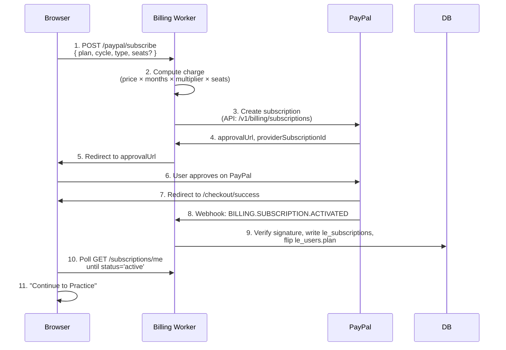

# Billing & plans

This page is the reference for everything money-related in the Legal Eagle SaaS workspace. It covers the four plan tiers, the math the cycle toggle uses, the checkout flow (PayPal first, PKR-domestic gateways scheduled), how invoices work, what happens when you downgrade or fail a payment, and the refund policy.

If you just want to pick a plan and go, the [Pricing page](https://legaleaglelaws.com/pricing) is the short version. This page is for the questions the pricing page can't fit.

## The four plan tiers

| Plan | Individual / month | Per-seat team / month (≥ 3 seats) | Trial |
|---|---|---|---|
| Free | $0 | — | — |
| Pro | $9 | $7 | none |
| Premium | $19 | $14 | 14 days, payment method captured |
| Ultimate | $24 | $19.99 | none |

The price above is the **equivalent monthly rate**. Prepaying for longer cycles applies a multiplicative discount.

## The cycle multiplier

Annual prepay isn't a separate price — it's a multiplier on the monthly equivalent.

| Cycle | Multiplier | Pro effective monthly | Premium effective monthly | Ultimate effective monthly |
|---|---|---|---|---|
| Monthly | × 1.00 | $9.00 | $19.00 | $24.00 |
| Quarterly (3 mo prepay) | × 0.93 (− 7 %) | $8.37 | $17.67 | $22.32 |
| Half-yearly (6 mo prepay) | × 0.87 (− 13 %) | $7.83 | $16.53 | $20.88 |
| Yearly (12 mo prepay) | × 0.80 (− 20 %) | $7.20 | $15.20 | $19.20 |

The charge formula is straightforward:

```
chargeAmountUsd = monthlyPriceUsd × cycleMonths × cycleMultiplier
```

A worked example. **Premium yearly, individual:**

```
charge = 19 × 12 × 0.80 = $182.40 — billed once at confirmation
```

A second example. **Premium yearly, team plan with 5 seats:**

```
charge = 14 × 5 × 12 × 0.80 = $672.00 — billed once at confirmation
```

The toggle on `/pricing` recomputes the effective rate and the headline charge in real time, so you can compare without doing the math yourself.

## What's included at each tier

The full limits matrix is on [Getting started](../getting-started.md#whats-included-at-each-tier). The shorthand:

- **Free** — five active cases, twenty contacts, ten notes, ten events / month, no Drive uploads, no court-sync, no public profile.
- **Pro** — fifty cases, two hundred contacts, two hundred notes, daily court-sync, public profile, Drive uploads up to five hundred files.
- **Premium** — five hundred cases, two thousand contacts, two thousand notes, four-hourly court-sync, larger profile caps, 14-day trial.
- **Ultimate** — most caps lifted, hourly court-sync, white-label deliverable export, early access to new features.

## The checkout flow

PayPal is the v1 gateway. PKR-domestic gateways (PayFast, PayPro, XPay) and Stripe are scheduled for v2.



Important properties:

- **You never see a worker secret** in the browser. The worker holds the PayPal client secret; the browser interacts with PayPal directly via the approval URL.
- **The webhook is the source of truth.** The browser polling step in 10 is a UX nicety — even if the user closes the tab between PayPal approval and our database write, the webhook still arrives and activates the subscription.
- **Idempotency** is per-event. PayPal redelivers webhooks; the worker dedupes on `providerEventId` so re-deliveries are no-ops.
- **Audit trail** is permanent. Every webhook lands in `le_billing_events` with the raw payload and a signature-valid flag, regardless of whether processing succeeded — so failed webhook handling can be retried later from the audit log.

## The Premium 14-day trial

Premium is the only tier with a free trial.

- The trial captures a payment method up front. PayPal handles this; we just record `status='trialing'` and `trialEndsAt`.
- The first charge fires at `trialEndsAt`; from then on PayPal charges per cycle.
- Cancelling before `trialEndsAt` is free of charge.
- The workspace shows the trial countdown in the top bar of `/practice` and on `/practice/billing`.

## Invoices and receipts

Every successful charge writes an invoice row at `le_invoices`. The receipt is generated server-side and is available on `/practice/billing`:

- Invoice number, date, status (paid / pending / refunded).
- Plan, cycle, type, seats.
- Charge amount in USD, plus the PKR-equivalent at the gateway's rate (when relevant).
- Provider's transaction ID.
- A downloadable PDF.

PayPal also sends its own receipt to your PayPal email; the workspace's receipt is the platform's record.

## Downgrade behaviour

Downgrading or letting a payment fail past the grace period is a **non-destructive** path:

1. The plan flag flips to the lower tier (or `free`) at the cycle boundary.
2. **No data is deleted.** Cases, contacts, notes, files, events all stay.
3. The workspace shows an "over the cap" warning if you have more of a kind than the new tier allows. The over-cap kind goes **read-only** for creates — you can view and archive but not create new ones until you're under cap or upgrade again.
4. Public profile is automatically unpublished if your new tier doesn't include it. The data underneath stays.
5. Court-sync auto runs are paused if your new tier doesn't include auto sync. Manual sync drops to the new tier's quota.

The grace period after a failed payment is plan-defined (typically a few days). You see exact dates on `/practice/billing`. Add a working payment method and the grace clock resets.

## Refund policy

These are the v1 defaults; the [Terms of Service](https://legaleaglelaws.com/terms) is the binding version.

- **Seven-day money-back from initial subscription start.** No questions asked. Email billing support and we issue a full refund.
- **After seven days**, prorated refunds for downgrades. No refunds for cancellations of in-flight cycles — the subscription continues until `renewsAt`, then expires.
- **Trial cancellations before `trialEndsAt` are free.**
- **Disputes** go through the gateway's own dispute process (PayPal's resolution centre); we do not contest disputes that fall within the policies above.

## Currency

The platform displays USD globally. PKR-domestic gateways (when they ship) auto-convert at checkout using the gateway's USD → PKR rate; the receipt shows both. PayPal charges USD directly; your card or PayPal account handles the conversion to your account currency.

The pricing page does **not** show PKR equivalents on the `/pricing` page itself in v1, deliberately — keeps the page simple and avoids stale conversion rates.

## Tax and invoicing for Pakistan

V1 issues invoices in USD via the gateway's tax handling. When PKR-domestic gateways ship in v2, the platform will revisit Pakistan-specific tax line items (GST) on those invoices. Until then, if your tax position requires a particular invoice format, contact billing support.

## Cancelling

`/practice/billing` → **Cancel subscription**. Two choices in the dialog:

- **Cancel at end of current cycle** (default) — keep workspace access until `renewsAt`, then drop to Free. This is what most users want.
- **Cancel immediately** — drop to Free now, with prorated refund per the policy above.

After cancellation:

- All your data stays on the platform.
- You can resubscribe at any time; the data picks up where you left off.
- Plan flag is `free` once the cycle ends; the over-cap warnings kick in if applicable.

## Use cases

### Choosing the cycle

Most lawyers pick yearly for the 20% saving, paying upfront once. Quarterly is a good middle ground (7% off, lower commitment). Monthly is best when you're still evaluating or have unstable cash flow; you'll pay the full equivalent rate but can cancel any time.

### Switching to a team plan

When you bring on a junior or a chamber partner, switch from individual to team on `/practice/billing → Change plan`. The minimum is 3 seats; below that, individual is the right shape. The team plan splits per-seat — your cost on Pro team / 3 seats is `7 × 3 = $21/mo` equivalent, vs `$9` solo.

### Upgrading mid-cycle

Going from Pro to Premium mid-cycle prorates the difference; the charge happens immediately. The cycle boundary stays the same — your next renewal date is unchanged.

### Trying Premium for free

Click **Start 14-day Premium trial**, complete PayPal capture, get full Premium access for 14 days. Cancel before day 14 to avoid being charged. About a third of trial users cancel; the rest convert. There's no penalty for either path.

### Switching gateway later (when PKR ships)

Cancel at end of cycle on PayPal, start new subscription on the PKR gateway. The platform's subscription model is gateway-agnostic; the workspace experience is identical.

## Limitations

- **PayPal only at v1.** PKR-domestic gateways (PayFast, PayPro, XPay) are scheduled. Stripe arrives in the same v2 release.
- **No coupons or promo codes** in v1.
- **No tiered annual rates.** The cycle multiplier is the only discount lever.
- **No mid-cycle plan downgrade refunds beyond the seven-day window.** Downgrades take effect at the cycle boundary.
- **Team admin (per-seat invoicing splitting, member assignment)** is a feature flag on team plans; full team-admin docs are a separate roadmap page.
- **Pakistan tax invoicing** awaits PKR-domestic gateway launch.

## Frequently asked questions

### Why PayPal first?

PayPal supports lawyers in Pakistan paying in USD with reasonable friction and accepts most international cards. PKR-domestic gateways need additional integration and tax handling, so they ship in v2 — but PayPal is enough to launch.

### Can I be billed in PKR?

Not in v1. Your bank or card provider may convert PayPal's USD charge to PKR with their own FX rate; PayPal also offers conversion at the time of charge. PKR-domestic gateways arrive in v2 and will charge PKR directly.

### Are there any per-seat overages?

No. Team plans bill per seat purchased, not per active user. If you bought 5 seats and only 3 are active, you still pay for 5; you can decrease seats at the next cycle boundary.

### Why 3-seat minimum on team plans?

The per-seat team price is meaningfully lower than individual ($7 vs $9 on Pro, $14 vs $19 on Premium, $19.99 vs $24 on Ultimate). The 3-seat minimum keeps the discount honest — solo lawyers buying a "team plan of 1" would defeat the differentiation.

### Can I get an invoice in my firm's name?

Yes — the `/practice/billing → Invoice settings` form lets you set a billing name and address. New invoices use those fields; past invoices stay as they were.

### What if my card is declined mid-cycle?

PayPal retries on its own schedule; the workspace shows `status='past_due'` with a clear "update payment method" CTA. Past the grace period, the plan downgrades to Free per the [downgrade behaviour](#downgrade-behaviour) above. Your data stays put.

### Can I get a quote / contract for an enterprise rollout?

For small chambers, the team plan is the supported path. For larger firms, contact info@legaleaglelaws.com — enterprise contracts are handled case by case.

### Do you offer educational or non-profit discounts?

Not in v1. Free tier is genuinely usable for individual learning and small caseloads, which serves the educational case.

## Related pages

- [Getting started](../getting-started.md) — plan tiers and onboarding wizard.
- [Integrations overview](./overview.md) — at-a-glance comparison.
- [Public profile](../public-profile.md) — Pro-and-above feature; this page covers the cost.

## Author

Billing worker, the gateway abstraction layer, and this documentation built by **[Ahsan Mahmood](https://aoneahsan.com)**.
