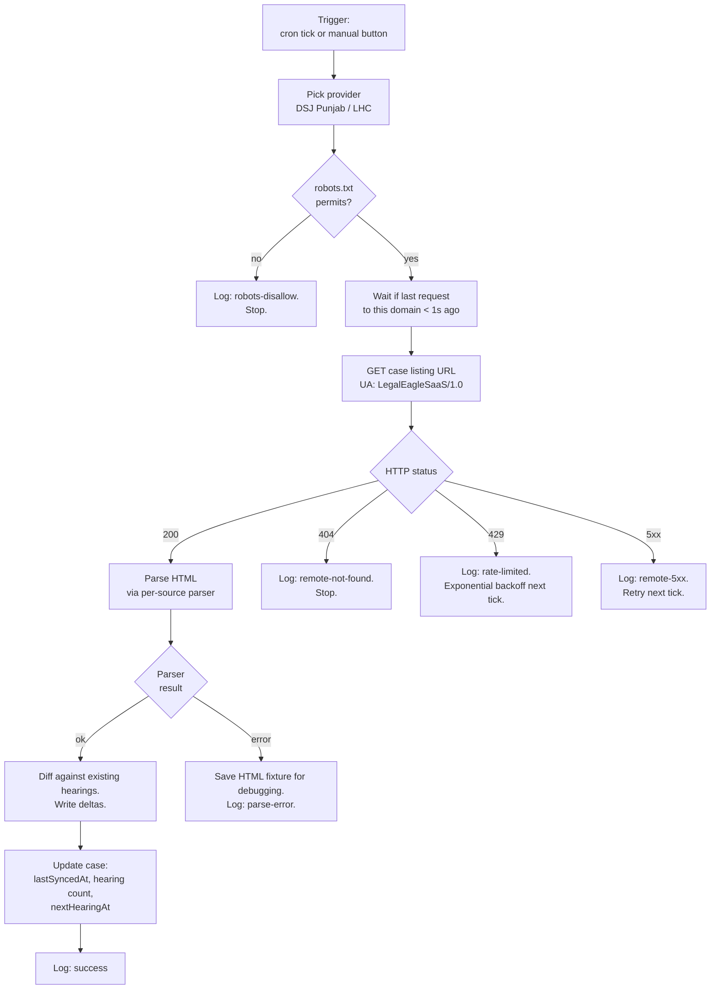

# Court-sync

Court-sync is the part of the Legal Eagle SaaS workspace that periodically polls **public Pakistan court websites** for the cases you have flagged, parses the hearing listings, and writes back hearing dates to your matter. It saves you from re-checking the Punjab District & Sessions Judiciary or Lahore High Court website by hand every morning. It is a productivity convenience — not the authoritative source of truth — and the workspace surfaces every run in an audit log so you can verify what happened.

This page covers what court-sync does, what it deliberately does not do, the worker's architecture (at the level appropriate for a public docs page), the parser contract, and the failure modes you'll occasionally see. Available on Pro, Premium, and Ultimate.

## What it does

For each case where you have flipped **Enable court-sync** in the case detail page's Sync tab:

1. The platform's secure Cloudflare Worker visits the public listings page on the court website you selected (Punjab DSJ or LHC).
2. It parses the listing for your case using a per-source parser.
3. It writes any new hearings as entries on your case, alongside the date, judge, courtroom, brief outcome, and a snapshot URL of the source page at the time of fetch.
4. It logs the run — success, partial, error — in your case's Sync tab and admin's audit log.

Two cadences are supported. **Automatic sync** runs on a schedule scaled to your plan tier. **Manual sync** is a button you press from the Sync tab; the per-day quota again scales by plan.

## What it explicitly does NOT do

- It does **not** authenticate as you to the court website. The court sites are public; sync uses the same URL anyone with a browser would use.
- It does **not** bypass captchas, login walls, or paywalls. If a court page is gated, sync simply cannot fetch it; the Sync tab surfaces the failure.
- It does **not** store full HTML of court pages by default. It records only the parsed hearings plus a snapshot URL pointer. Failed pages may be archived to a debug fixture for parser debugging — see [parser regressions](#parser-regressions).
- It is **not** an authoritative source. Always confirm critical hearing dates with the court directly the day before. Court websites occasionally publish wrong dates, lag updates by a day or two, or change format without notice.
- It does **not** notify the court that we polled. We identify ourselves with a descriptive User-Agent (`LegalEagleSaaS/1.0 (+https://legaleaglelaws.com/court-sync-info)`) and respect robots.txt; that's the level of courtesy a public scraper owes the public site.

## Plan limits

| Plan | Manual sync per day | Auto sync interval |
|---|---|---|
| Free | — (disabled) | — |
| Pro | 1 / day | every 24 hours |
| Premium | 24 / day | every 4 hours |
| Ultimate | 96 / day | every 1 hour |

Counters reset at UTC 00:00. Hitting the manual cap returns a clear "wait until reset at HH:MM" message; auto-sync continues regardless.

## How a sync run works

Per case, the worker executes:



A few important properties of this flow:

- **Throttle is at least 1 request per second per upstream domain.** A single cron tick handling many cases interleaves them respecting this — DSJ Punjab gets one request per second, LHC gets one per second, in parallel.
- **Diff is by content hash** of `(date, summary, judge)`. The same hearing parsed across two runs is recognised as the same; the second run is a no-op. New hearings are written; updates to an existing hearing's outcome are written as edits with the prior content kept in the timeline.
- **Each hearing entry stores the snapshot URL** of the source page at the time of fetch. If you ever need to dispute a parsed entry, the URL gives you the original.

## Parser contract

Parsing is a pure function — no I/O — so it can be unit-tested on saved HTML fixtures. Each source has its own parser:

```ts
interface BaseParser {
  readonly id: 'dsj-punjab' | 'lhc';
  readonly version: string;            // bumped when output shape changes
  buildSearchUrl(caseNumber: string, filingYear: number, court?: { city?: string }): string;
  parse(html: string, caseInput: { caseNumber: string; filingYear: number }): ParseResult;
}
```

The parser returns hearings, the next hearing date if known, and its own version string. The version is recorded on every hearing entry — so if a parser change ever produces a different shape of output, the workspace can audit which parser version emitted which entry.

## Parser regressions

The pages we parse are HTML rendered by the court websites; that HTML changes occasionally. When it changes in a way the parser does not anticipate:

1. The parser either throws or returns zero hearings on a previously-known-good case.
2. The worker saves the failed HTML to a fixture (so the parser can be repaired from a real example).
3. The case's Sync tab shows `outcome='parse-error'` in the run history, with a clear "your case data is unaffected" reassurance.
4. After three consecutive parse failures on the same case, sync is auto-paused for that case to avoid noisy retries. The Sync tab tells you it's paused and how to resume.
5. The platform's admins are alerted; a parser fix typically lands the same day or the next.

You don't have to do anything when this happens — your manual hearing entries are unaffected, the platform will fix the parser, and the next successful run resumes population. If you suspect a parse error is silently producing wrong dates rather than zero dates, send a help request — that case is exactly why every entry stores a snapshot URL.

## Compliance and courtesy

The worker is a well-behaved public scraper:

- **robots.txt** is fetched once per domain per 24 hours and respected. If a court website disallows a path, the worker logs `robots-disallow` and does not fetch.
- **User-Agent** identifies the platform: `LegalEagleSaaS/1.0 (+https://legaleaglelaws.com/court-sync-info)`. That info page (linked in the UA) explains what we fetch, why, and gives upstream operators contact info to opt out if they object.
- **Throttle** is at least 1 second between requests per domain. Real-world load on a court site is at most a couple of requests per second across all SaaS users — orders of magnitude below normal browsing traffic.
- **Backoff** on 429 / 5xx is exponential up to 1 hour. If a domain shows >50% failure for 6 hours, an admin alert fires; the platform stops retrying that domain until the admin acknowledges.

If you operate a court website and want Legal Eagle to stop polling specific paths or to slow down, the contact link in our User-Agent is the right channel. We respond.

## What you see in the workspace

`/practice/cases/:id/sync` (the Sync tab on the case detail page) shows:

- **Sync enabled** toggle.
- **Source** picker — DSJ Punjab or LHC.
- **Matching key** — case number plus filing year, or party name plus year, depending on what the source supports.
- **Last successful sync** timestamp.
- **Run history** — the last several runs with outcome, hearings added, and a "view source page" link.
- **Manual Sync now** button (rate-limited per plan).
- **Status banner** when something is unusual — robots disallow, repeated parse-error, paused after consecutive failures.

The platform-wide admin sees an aggregate dashboard at `/admin/court-sync`: worker health, recent failures, parser version, saved fixtures index. (Admin docs are a separate batch; this page is for lawyers using the workspace.)

## Use cases

### Daily morning check

Every Pro+ user with court-sync enabled wakes up to a workspace where new hearings parsed overnight are already on the right cases. Open `/practice/calendar`, sort by date, plan the day.

### Premium user with many active cases

Premium runs auto-sync every 4 hours. A new hearing posted by the court at 10 AM appears on your case by 2 PM at the latest. With 24 manual syncs per day, you can pull urgent updates between scheduled runs.

### Disputing a parsed entry

A hearing on your case shows a date you didn't expect. Open the hearing detail; the snapshot URL takes you to the live court page. If the court page agrees with the workspace, the surprise is on the court's side. If the court page disagrees — likely a parser bug — send a help request with the URL.

### Pausing sync on a closed case

When a case closes, flip the Sync enabled toggle off. No more polls, no more entries; the existing entries stay as-is. Reopening the toggle resumes.

### Migrating between sources

If a case starts in DSJ and goes on appeal to LHC, you can repoint the source from DSJ to LHC in the Sync tab. Existing DSJ-parsed hearings stay; future runs read LHC.

## Limitations

- **Coverage is Punjab DSJ + LHC at v1.** Other provincial high courts (Sindh, KPK, Balochistan), the Federal Shariat Court, and the Supreme Court of Pakistan are scheduled but not built.
- **Parser depends on the court website's HTML structure.** When the court redesigns, expect a few hours to a day of regression while the parser is updated.
- **No real-time push from courts.** The platform polls; it cannot subscribe to a webhook the courts do not offer.
- **Granularity is per-case.** You cannot subscribe to "all my cases at this court" — each case is a separate sync target. Bulk-enabling sync across a list view is on the roadmap.
- **Manual sync rate limits are strict.** A Pro user with one manual sync per day has to wait until UTC midnight after the first manual; auto-sync continues, but if you specifically want a fresh poll, plan for the cap.
- **Snapshot URLs point to the live court page,** not an archived copy. If the court takes the page down, the snapshot becomes a 404.

## Frequently asked questions

### Is court-sync legal?

We are polling public web pages, identified by a transparent User-Agent, respecting robots.txt, throttling courteously. The same data is available to anyone with a browser. Pakistani law, like most jurisdictions', allows access to public records; the platform's compliance posture is transparent and described on the public info page in the User-Agent. We are not aware of any legal objection from the courts. If a court raises one, we adjust.

### Can the courts block Legal Eagle?

Yes — robots.txt is the polite mechanism, and we respect it. An IP block would be heavier-handed but possible; the platform would notice immediately because every request would fail. We have not encountered this.

### Why is the auto-sync interval different per plan?

Cost. Each sync run consumes worker compute and incurs upstream load. Free is disabled to prevent abuse; Pro at 24-hour cadence is the lowest commercially supportable; Premium at 4 hours fits most active practices; Ultimate at 1 hour is for the unusual high-frequency users.

### What if I'm a lawyer in Sindh / KPK?

V1 doesn't help yet — your provincial high court isn't on the parser list. Add the case to the workspace anyway with manual hearing entries; when the parser ships, your case is ready to enable sync.

### Can I see what data the worker stored from a sync?

The case Sync tab shows the run log; each hearing entry on the case has a "source: court-sync" badge with the timestamp and the snapshot URL. That's the full audit trail visible to you. The platform's database holds nothing more for the run.

### What happens if Legal Eagle's court-sync worker is down?

Auto-sync misses scheduled ticks until the worker recovers. Existing case data is unaffected. The Sync tab shows the last successful run so you know whether you're missing recent updates.

### Can I download the run history as a CSV?

Per-case run history is available on the Sync tab; CSV export of run logs is on the roadmap for Premium and above.

### Does court-sync ever modify hearings I entered manually?

No. Manual hearings are flagged with `source: 'manual'` and are not touched by sync runs. Only hearings the parser finds and writes carry `source: 'court-sync'`.

## Related pages

- [Cases](../cases.md) — the Sync tab is part of the case detail page.
- [Integrations overview](./overview.md) — at-a-glance comparison.
- [Getting started](../getting-started.md) — court-sync is the highest-value integration to enable on a paid plan.

## Author

Court-sync worker, parsers, and this documentation built by **[Ahsan Mahmood](https://aoneahsan.com)**. Public info on what we fetch and why is at [legaleaglelaws.com/court-sync-info](https://legaleaglelaws.com/court-sync-info).
