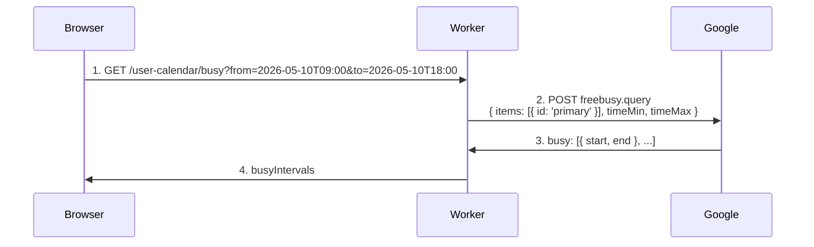
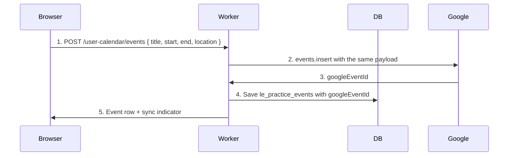

# Google Calendar integration

The Google Calendar integration in the Legal Eagle SaaS workspace does two things: it reads your **free/busy** windows so the workspace can warn you before you double-book, and it can **push events you create in the workspace** to your Google Calendar so they show up everywhere your Calendar shows up. Both are optional. Both are revocable. Neither reads the titles, attendees, or descriptions of your existing Google Calendar events.

This page goes deeper than the [Calendar feature page](../calendar.md) — it covers the OAuth scope, what flows over the wire, multi-calendar selection, refresh windows, and the failure modes that occasionally bite.

## Why this exists

Lawyers run on calendars. Court hearings, client consultations, internal chamber meetings, deadlines, personal commitments — all compete for the same eighteen waking hours. The workspace's own calendar at `/practice/calendar` already shows the workspace events; what it doesn't know about, until you connect Google Calendar, is everything **outside** the workspace. The conflict-detection feature closes that gap without forcing you to dump all your personal calendar data into the platform.

## What `calendar.events` means

Google offers a graded set of Calendar scopes. The platform requests **`calendar.events`**:

- The platform can **read** events on the calendars you give access to, **including their titles, times, and attendees** — but the workspace deliberately uses only the free/busy projection of that data unless you explicitly create or edit events through the workspace's own UI.
- The platform can **create, modify, and delete** events on those calendars when you take an action in the workspace that produces such an event.
- The platform **cannot** modify Calendar settings, share calendars on your behalf, or do anything beyond event-level operations.

A narrower scope (`calendar.freebusy`) would let the platform read busy windows but not create events; that scope was rejected because the two-way event sync in the workspace's calendar UI needs writes. A broader scope (`calendar`) would expose calendar settings and ACLs, which the platform does not need.

Although the scope grants more than free/busy, the workspace's actual reads are intentionally limited. The conflict-check call uses Google's `freebusy.query` API endpoint — Google returns only opaque busy intervals, not titles. The workspace UI never displays an external event's title, attendees, or description; only "you're busy from X to Y" overlays.

## The first connection

From `/practice/calendar/connect` (or the onboarding wizard's Step 3):

1. Click **Connect Google Calendar**.
2. Google's OAuth consent screen appears with the `calendar.events` scope visible.
3. Approve. Google redirects back with a one-time code.
4. The workspace's secure worker exchanges the code for tokens, encrypts the refresh token, stores it, and sets your `hasGoogleCalendarConnected` flag.
5. The workspace fetches the list of calendars your Google account can read and offers a **primary calendar** picker. By default it selects the calendar marked primary on your Google account.

You can change the primary calendar later from `/practice/settings/integrations` without re-doing OAuth.

## What flows over the wire

### Conflict-check (free/busy)

When you open the Add Event dialog in the workspace calendar:

The browser then renders busy intervals as faint blocks over the schedule. When you pick a slot that overlaps, the form shows a yellow banner: *"Possible conflict at this time."*

### Push (event creation)

When you save a workspace event:

If push to Google fails (Google API error, transient 5xx), the workspace event still saves locally; the row gets `pushedToGoogleAt = null` and a "not synced" indicator with a manual retry button. Subsequent edits or deletes in the workspace are **also** mirrored to Google: `events.patch` for edits, `events.delete` for deletes. The platform does not silently swallow sync failures.

### Refresh windows

Free/busy is fetched on demand for the time range the dialog covers — typically the next 60 days for a workspace event a couple of weeks out. The worker does not maintain a long-running snapshot; each conflict check is a fresh call.

That said, conflict warnings have a small caveat: if you add a Google Calendar event in another tab and immediately open the Add Event dialog in the workspace, the workspace's call to Google Calendar should reflect the new event within a few seconds — Google's free/busy is real-time. There is no "last-30-minute snapshot" that needs to age out.

## Multi-calendar selection

Most Google accounts have more than one calendar — a personal one, a work one, perhaps a shared family calendar, and any third-party-imported holiday calendars. By default the workspace reads free/busy from your **primary** calendar only.

From `/practice/settings/integrations`, you can select **additional calendars** to include in conflict checks. Pick the ones whose busy state actually constrains your professional time. Excluding the holiday calendar, for instance, prevents "you're busy on Eid" from blocking court dates that, in fact, are scheduled around Eid.

Push (event creation) always goes to the primary calendar. There is no per-event calendar picker in v1; if you need an event on a different calendar, copy it manually after creation.

## Disconnect behaviour

`/practice/settings/integrations` → **Disconnect Google Calendar**.

What happens:

1. Worker calls Google's `/revoke` with your refresh token.
2. Encrypted refresh-token row is deleted.
3. User flag flips to disconnected.
4. The workspace stops calling Google for free/busy or event push.

What stays:

- **Workspace events remain in the workspace.** Their `googleEventId` field still holds the ID for events that were pushed before disconnect, but the platform can no longer touch those events.
- **Events already pushed to Google stay on Google.** They are normal Calendar events; you manage them from Google directly.
- **Subsequent workspace events do not push.** They live workspace-only until you reconnect.

To reconnect: either the same Google account (the platform reuses existing `googleEventId` values to keep editing events it created earlier) or a different account (existing `googleEventId` references are orphaned; future events go to the new account).

## Use cases

### Schedule a hearing without colliding with personal time

You set a hearing for next Tuesday at 11 AM. The workspace shows that you have a doctor's appointment from 10:30 to 11:30 already on your Google Calendar (only as an opaque busy block — the workspace doesn't show "doctor"). You shift the hearing to 2 PM.

### Push every workspace event to your phone's Calendar app

Your phone's Calendar app subscribes to your Google Calendar. With the integration enabled, every workspace event you create shows up on your phone, your laptop, your spouse's shared family calendar — anywhere you've already wired your Google Calendar.

### Read-only mode (no push)

If you want conflict warnings but do not want the workspace creating events on your Calendar, disable the **Push events to Google** toggle in `/practice/settings/integrations`. The integration becomes one-direction read-only; conflict checks still work; nothing is written.

### Multi-calendar scheduling for a chamber

A small chamber connects each lawyer's Google account separately. Each lawyer sees their own conflicts during scheduling. There is no v1 mechanism for cross-lawyer free/busy lookup inside the workspace; that's roadmap.

### Selectively excluding the holiday calendar

You imported a Pakistan holidays calendar to your Google account; it shows public holidays as full-day busy blocks. In `/practice/settings/integrations`, leave only the personal and work calendars selected. The workspace's conflict check ignores the holiday calendar; you can still schedule on holidays if a particular hearing is so listed.

## Limitations

- **One Google account at a time.** The integration is per-user; switching accounts means disconnecting and reconnecting.
- **Push goes to primary calendar only** in v1. Per-event calendar picker is roadmap.
- **No CalDAV / iCloud / Outlook in v1.** Google Calendar only.
- **Recurring events are simple.** Daily, weekly, monthly recurrences supported. Complex patterns ("every other Tuesday until July") are limited.
- **Reminders are independent of Google's reminders.** Setting a reminder in the workspace does not propagate to Google Calendar's reminders, and vice versa.
- **Free/busy excludes events you have declined** by Google's default behaviour. If you need declined events to count as busy, that's a Google Calendar setting (Settings → Event settings → "Show declined events").
- **Timezone is the workspace timezone.** Events are shown in your `/practice/settings` timezone; cross-timezone planning needs manual conversion.

## Frequently asked questions

### Will Legal Eagle see my private events' titles?

The platform's only display surface for external events is the conflict overlay, which shows opaque busy blocks — never titles. The OAuth scope `calendar.events` does technically permit reading titles; the platform deliberately doesn't render them. If this matters to you, the audit trail on Google's side will show only `freebusy.query` calls for read operations.

### What if I don't want any read of my external calendar?

Don't connect Calendar. The workspace calendar runs standalone — you simply don't get conflict warnings against your Google Calendar.

### Can I push to a calendar other than my primary?

In v1, no. Push goes to the calendar marked primary on your Google account. The roadmap includes a per-event calendar picker.

### What happens if I edit a pushed event directly in Google?

The next time the workspace fetches that event (rare — the workspace doesn't poll), it would notice the divergence. In v1 the workspace does not periodically reconcile; the workspace's copy is treated as the source of truth for event metadata, and the workspace's edit/delete actions overwrite Google. If you need to edit, edit in the workspace.

### Does the platform call Google Calendar's API even when I'm not logged in?

No. Without your active session, no read or push happens. The cron-based court-sync worker is independent and does not touch your Calendar.

### What about Google Calendar's notifications / pop-ups?

Those are Google features. The workspace's "Reminder" field on an event is independent — it triggers in-app banners, push notifications on the mobile build, and optional email. Google's pop-up notifications fire from Google's side based on Google's settings.

### Are there rate limits I might hit?

Google enforces a per-user rate limit on `freebusy.query` (currently 1 000 / 100 seconds / user, generous). The workspace's UI generates one query per Add Event dialog open, well below the limit.

### What if my Google account uses 2-Step Verification or app passwords?

OAuth flows work normally regardless of 2SV — the consent screen handles the second factor inline. App passwords are not needed; OAuth is the modern path.

## Related pages

- [Calendar feature page](../calendar.md) — how the workspace's calendar UI uses this integration.
- [Integrations overview](./overview.md) — at-a-glance comparison.
- [Getting started](../getting-started.md) — onboarding Step 3 walks through this.

## Author

Calendar integration, worker, and this documentation built by **[Ahsan Mahmood](https://aoneahsan.com)**.
