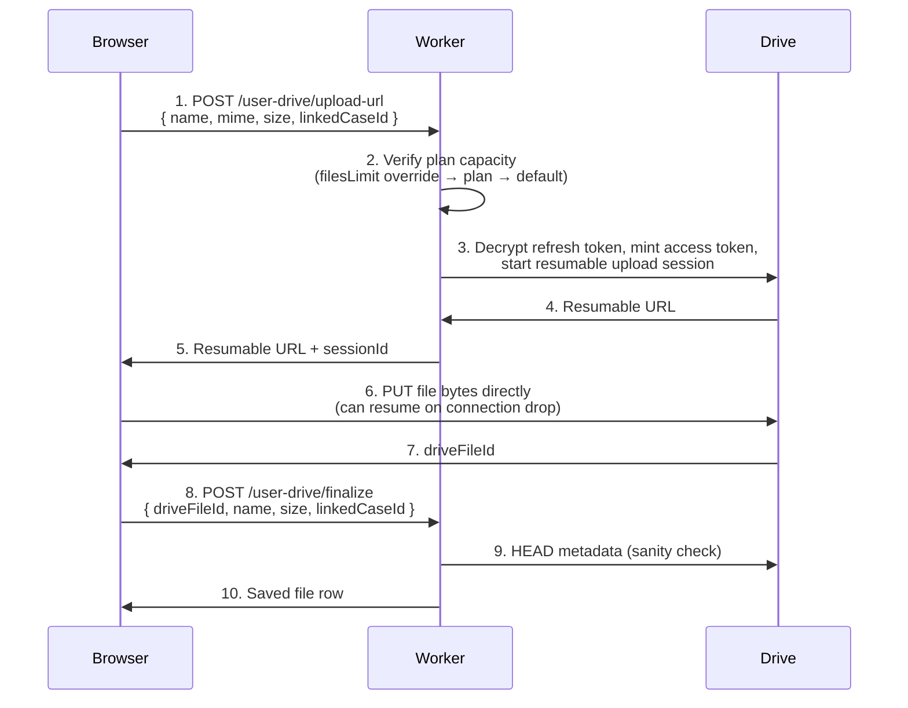

# Google Drive integration

The Legal Eagle SaaS workspace stores **file bytes in your own Google Drive** rather than on Legal Eagle's servers. We hold the metadata — file name, mime type, size, the Drive ID, who uploaded, when, which case the file is linked to — and Drive holds the actual content. The trade-offs are deliberate: you keep ownership and portability of your files, our infrastructure cost stays at zero per gigabyte, and you can sever the integration at any time without losing your bytes.

This page covers what the Drive integration does, what permission it asks for, the upload flow end-to-end, plan caps, and disconnect behaviour. Available on Pro, Premium, and Ultimate.

## What it is, in one sentence

A `drive.file`-scoped OAuth connection that lets the workspace create and read **only the files this app uploads to your Drive**, organised in a single `Legal Eagle` folder, with bytes streamed direct browser-to-Drive on resumable uploads.

## What `drive.file` means

`drive.file` is the narrowest non-trivial Drive scope Google offers:

- The platform can **create** files in your Drive.
- The platform can **read and update** files **that this app created** or that **you explicitly opened with this app via the Drive picker**.
- The platform **cannot** list, read, or modify the rest of your Drive.

In practical terms: every other file in your Drive — photos, your existing PDFs, shared family documents, your spouse's spreadsheets — is invisible to the workspace. Even Google's own audit log will show the platform touching only the rows under the `Legal Eagle` folder.

The alternative scope (`drive.readonly` or `drive`) would let the platform read everything; the platform deliberately does not request that. The cost of the narrower scope is real but small — the file picker for re-attaching pre-existing files needs explicit user clicks. We accept that cost.

## The first connection

From `/practice/files/connect` (or the onboarding wizard's Step 2):

1. Click **Connect Google Drive**.
2. The platform redirects you to Google's OAuth consent screen with the `drive.file` scope. The screen shows the app name, the requested scope, and a Google-controlled "More info" link.
3. Approve. Google redirects back to the workspace with a one-time code.
4. The workspace's secure Cloudflare Worker exchanges the code for tokens (browser never sees them), AES-GCM encrypts the refresh token, writes it to a deny-all-on-the-client database row, and flips your `hasGoogleDriveConnected` flag.
5. The workspace shows "Connected as `your-email@gmail.com`" with the connected-at date.

The first connect also creates a folder named `Legal Eagle` at the root of your Drive. Subsequent uploads go into that folder. If you later move the folder to a different parent in your Drive (perhaps a shared drive your firm runs), the platform follows it by Drive ID — there's no path-string brittleness.

## The upload flow

When you click **Upload** on a case Documents tab or `/practice/files`:

A few points worth knowing:

- **Bytes never travel through our worker.** Step 6 is a direct browser-to-Drive PUT. Workers are not designed for large bytes; resumable uploads are. This means even very large PDFs (court records, deposition videos) work fine — they bypass the worker entirely.
- **Capacity is checked at the worker** before the resumable session is opened. Trying to upload your 21st file on a Free plan returns an "over limit" response and surfaces an in-context upgrade card; no bytes wasted.
- **Resumable means resumable.** If your upload is at 60% and connectivity drops, the browser can pick up where it left off when connectivity returns, using the same Drive session URL.
- **Capacitor on mobile** uses `@capacitor/filesystem` to pick a file, then reuses the same resumable-URL flow. iOS requires the `NSPhotoLibraryUsageDescription` and `NSDocumentsFolderUsageDescription` Info.plist entries; Android on API 30+ uses the Storage Access Framework with no special permission.

## What gets stored where

| Data | Location |
|---|---|
| File bytes | Your Drive, in the `Legal Eagle` folder |
| File name, mime, size, uploaded-by | Our database (`le_practice_files`) |
| Linked case ID | Our database |
| Drive ID + Drive web-view URL | Our database |
| Refresh token | Our database, AES-GCM encrypted |

When you click a file row in the case Documents tab, the workspace opens its `driveWebViewUrl` in a new tab — this is Drive's own UI, your own session, your own access controls. The platform does not proxy file content.

## Plan caps and counters

| Plan | Files cap | Notes |
|---|---|---|
| Free | 0 (Drive integration disabled) | Documents tab shows an upgrade card |
| Pro | 500 | Daily counter resets at UTC 00:00 |
| Premium | 5 000 | |
| Ultimate | unlimited | |

The cap counts files **uploaded through Legal Eagle**. Files you place in the `Legal Eagle` folder by other means (the Drive web UI, a desktop sync client) are not registered in our database and do not count — but they also won't show in the workspace until you explicitly attach them.

The cap does not bound bytes. Storage cost is yours — Google's free tier is 15 GB, paid tiers go to 2 TB and beyond on Google One. The platform never charges per gigabyte.

If your plan downgrades mid-cycle and you become over the cap, no files are deleted. The Documents tab continues to render existing files; uploads are blocked until you delete some or upgrade again.

## Disconnect behaviour

`/practice/settings/integrations` → **Disconnect Google Drive**.

What happens:

1. The worker calls Google's `/revoke` endpoint with your refresh token. Google's audit log records the revoke.
2. The encrypted refresh-token row in our database is deleted.
3. Your user flag flips to disconnected.
4. The platform's metadata rows for your files **stay**. The case Documents tabs still list them.
5. Clicking a file URL fails with Google's permission-denied page (the platform no longer holds the access right).

To re-enable access without losing the metadata:

- Reconnect Drive on the same Google account → the platform can reattach by Drive file ID.
- Or reconnect on a different account → those file IDs do not exist for the new account; the metadata rows show as "orphaned" and you can re-upload.

To completely remove the platform's data, **first** disconnect, **then** delete the file rows from each case Documents tab. The bytes in your Drive are unaffected by either step — they are yours.

## Use cases

### Uploading a court order to a case

Open the case detail page → Documents tab → **Upload**. Pick the PDF. Watch the progress bar. The file lands in `Legal Eagle/` in your Drive and on the case timeline.

### Sharing a draft pleading with the client

Upload the draft to the case. Open the file in Drive (the workspace gives you a one-click link). Use Drive's own sharing controls to give the client read access. The platform doesn't re-share for you — Drive's sharing model is more nuanced than what we'd want to wrap.

### Bulk-archiving a closed case's files

When a case closes, the workspace lets you archive case data. Files stay in your Drive in the `Legal Eagle` folder; you can move them to your own archival folder using Drive's UI. The platform's metadata can be retained or deleted as you choose.

### Switching to a corporate Drive

Your firm gets a corporate Google Workspace. Connect Drive on that account instead of your personal one. Existing files on your personal account become orphaned metadata rows; re-upload from the new connection if you want them tracked.

### Auditing what files Legal Eagle has touched

Google's account activity page (`https://myaccount.google.com/security`) shows every OAuth grant. Filter to Legal Eagle to see exactly when access was granted, what scope was approved, and last activity time.

## Limitations

- **No file picker for pre-existing Drive files in v1.** You upload through the workspace; the workspace records a row. Attaching a file you uploaded outside the workspace (via Drive's own UI) requires re-uploading through the platform so the metadata row is created. The Google Picker integration to pick from your Drive directly is on the roadmap.
- **No automatic Drive→workspace sync.** If you rename or delete a file in Drive, the workspace's row does not update or remove itself. Manual re-attach.
- **No version history surfaced in v1.** Drive itself keeps versions; the workspace shows only the current version's metadata.
- **No shared-drive auto-discovery.** If your firm uses a shared (Team) Drive, you can manually move the `Legal Eagle` folder there; the platform will follow it. There is no UI yet for picking the parent shared drive.
- **iOS Capacitor build** requires the Info.plist usage descriptions called out above. If the app rejects file selection without an obvious reason, that's typically the cause.

## Frequently asked questions

### What if I'm at my Drive storage cap (Google's 15 GB free)?

Uploads will fail with Drive's "out of space" error, surfaced in the workspace as a clear error message. Upgrade your Google One plan or free up space; the workspace doesn't help directly here because storage is yours.

### Can I encrypt files before uploading?

Drive itself encrypts at rest by default. If you need additional client-side encryption (a privileged matter, perhaps), encrypt the file locally before upload — the workspace stores whatever bytes you give it. Drive search inside encrypted files won't work, by definition.

### Are uploaded files indexed for search by Legal Eagle?

No. The workspace stores filename + mime + size + linked case in our database. The file content is not indexed by us. Drive itself indexes content for its own search; that's Drive's feature, not ours.

### Can two team members on a team plan share files?

On team plans, the workspace's case data is shared across team members. Files attached to a case are visible to every team member through the workspace metadata. The actual Drive bytes live with whoever uploaded — for true cross-member access, the team should keep its `Legal Eagle` folder on a shared Google Workspace drive.

### What happens to my files if I delete my Legal Eagle account?

Account deletion removes our database rows. Your Drive bytes are untouched — they are yours. The `Legal Eagle` folder remains in your Drive with everything in it.

### Are files end-to-end encrypted?

Files are encrypted at rest by Google Drive. They are encrypted in transit between your browser and Drive. They are **not** end-to-end encrypted in the sense that Google holds the keys — the Drive default. For zero-knowledge encryption, encrypt before upload (point above).

### Why is the upload progress bar smoother on Drive than on the workspace UI?

The upload streams direct browser-to-Drive in step 6 of the flow above. The workspace UI mirrors progress events from the browser's upload XHR; Drive's reporting cadence is what you see.

### What if Google deprecates `drive.file` scope?

`drive.file` is a long-standing Google-recommended scope; deprecation would be a multi-year notice. If it ever happens, the platform would migrate to whatever the narrowest equivalent scope is.

## Related pages

- [Integrations overview](./overview.md) — at-a-glance comparison of every integration.
- [Cases](../cases.md) — the Documents tab consumes Drive uploads.
- [Getting started](../getting-started.md) — the onboarding wizard's Step 2 walks through this.

## Author

Drive integration, worker, and this documentation built by **[Ahsan Mahmood](https://aoneahsan.com)**.
