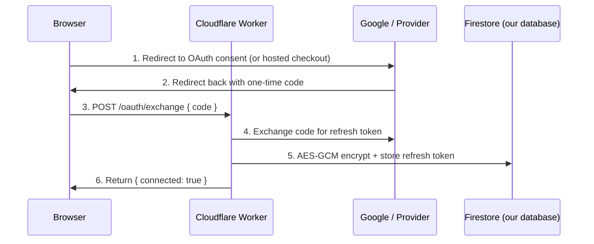

# Integrations overview

The Legal Eagle SaaS workspace at `/practice/*` connects to four external surfaces — your Google Drive, your Google Calendar, public Pakistan court websites (read-only), and a payment gateway — through narrowly scoped, revocable integrations. None of them are mandatory to start (Free tier needs none), and every one can be disconnected from `/practice/settings/integrations` without data loss.

This page is the **single source of truth** for what each integration does, what permission it asks for, where the data ends up, and the trade-off if you skip it. The deeper how-to pages for Google Drive, Google Calendar, court-sync, and billing live in this same section.

## At a glance

| Integration | Scope of access | Where bytes / data live | Required for |
|---|---|---|---|
| **Google Drive** | `drive.file` (only files this app creates) | Your Google Drive | File uploads on `/practice/files` and case Documents tabs (Pro+). |
| **Google Calendar** | `calendar.events` (read free/busy + create/edit events the app creates) | Your Google Calendar | Optional. Conflict warnings when scheduling. Two-way event sync. |
| **Court-sync (Punjab DSJ + LHC)** | Public court websites — no auth, no scope | The public court site you flagged a case for | Optional. Auto-fills hearing dates onto your cases (Pro+). |
| **Payment gateway (PayPal in v1)** | The gateway's own checkout session | Subscription state mirrored to our database | Required for any paid plan (Pro / Premium / Ultimate). |

## How an integration is connected

Three of the four (Drive, Calendar, Billing) use **OAuth-style flows** through the secure Cloudflare Worker that backs the SaaS platform. The browser does **not** ever see your refresh token, your card number, or any provider secret. The shape:

The fourth (court-sync) needs no consent because the court websites are public — Legal Eagle just polls the same URLs you would visit in a browser, with the same identifying user-agent and the same robots.txt compliance any well-behaved crawler uses.

## Where state lives, by integration

| Integration | Refresh token | Data the integration writes | Data the integration reads |
|---|---|---|---|
| Google Drive | Encrypted in `le_user_drive_secrets/{uid}` (deny-all on the client; only the worker reads) | File metadata in our database (name, mime, size, drive ID, link) | The file you choose to upload, on demand |
| Google Calendar | Encrypted in `le_user_calendar_secrets/{uid}` | Workspace events you create can be pushed to your Google Calendar | Free/busy windows in a 60-day forward range |
| Court-sync | None (no auth) | Hearing entries on `le_practice_cases/{id}/hearings` plus a per-run audit log | Public listings page for the case number you enabled |
| Billing | None visible to you (gateway-side) | Subscription rows in `le_subscriptions`, invoices in `le_invoices`, plan flag on `le_users/{uid}` | Webhook events from the gateway |

The worker uses one project-wide encryption key (`LEGAL_EAGLE_TOKEN_ENCRYPTION_KEY`) to seal every refresh token with AES-GCM before it touches the database. Deletion of the secret row at disconnect time is final — there is no way for the worker to read your tokens after that.

## What the platform deliberately does NOT do

Honest framing matters. Reading this list before connecting anything is faster than reading the deeper pages.

- **It does not read all of your Drive.** The `drive.file` scope means Google only hands the platform files this specific app created or that you explicitly opened with it. Your existing files, photos, and shared documents are invisible.
- **It does not read your Google Calendar event titles, attendees, or descriptions.** Default behaviour is free/busy only — opaque busy blocks. The two-way event sync (when you create an event in our workspace) writes events but reads only free/busy.
- **It does not bypass court-website access controls.** Court-sync uses public listing pages that anyone can browse. If a court page is behind a login or a captcha, sync simply cannot fetch it; the workspace surfaces this in the case's Sync tab.
- **It does not store your card number.** Card details live with the payment gateway. Our database stores subscription state (active / past-due / cancelled), invoice metadata, and a customer ID issued by the gateway.
- **It does not send marketing email** to clients you upload, contacts you add, or visitors who fill the public-profile contact form. Notifications are in-app.

## How to disconnect

`/practice/settings/integrations` lists every connected integration with the connected-at date and a **Disconnect** button. The button:

1. Calls the worker's `/oauth/revoke` endpoint for that integration.
2. The worker calls the provider's revoke endpoint (Google or the gateway) so the refresh token stops working at the provider's side too.
3. The worker deletes the secrets row from our database.
4. The user-doc flag (`hasGoogleDriveConnected`, etc.) flips to false.

After disconnect:

- **Drive** — your files remain in your Drive. The platform's metadata rows stay in your case Documents tabs, but clicking a file URL fails with Google's permission-denied page. To reuse the same files, reconnect Drive (the platform can reattach by file ID if you grant the same scope).
- **Calendar** — workspace events stay in the workspace. Events that were pushed to Google before disconnect remain on Google. Future workspace events do not push.
- **Court-sync** — disable per-case from the Sync tab; or pause globally from `/practice/settings/integrations`. Existing hearings entered by sync stay; future runs do nothing.
- **Billing** — cancel the subscription instead of "disconnecting". Cancellation drops you to Free at the end of the current cycle; data is retained.

## Use cases

### A new lawyer setting up

Start on Free. Connect nothing. Use the workspace's local-only features (cases, contacts, notes, calendar without conflict checks) for a couple of weeks to evaluate. When you upgrade, connect Drive and Calendar; enable court-sync per case as needed.

### A privacy-conscious advocate

Run on Pro without connecting Calendar. Use the workspace calendar standalone — no free/busy reads from your personal calendar, no event push-back. Connect Drive only for matters where you need shared files; otherwise keep file storage off-platform.

### A paid power user

Premium with all integrations on. Drive for every case's documents, Calendar for conflict-free scheduling, court-sync at the 4-hour cadence on every active matter, billing on yearly cycle for the 20% discount.

### Switching gateways later

When PKR-domestic gateways arrive in v2, your existing PayPal subscription continues unchanged. To switch, cancel on PayPal at the end of the cycle, then start a new subscription on the PKR gateway. The platform's subscription model is provider-agnostic; the user-facing experience is identical.

### Annual audit

Once a quarter, open `/practice/settings/integrations` and review what's connected. If you no longer need an integration — say, you stopped using Google Drive externally — disconnect. The page shows the connected-at date so you can see how stale a connection has become.

## Limitations

- **English-only consent screens.** Google OAuth screens are in your Google account language; the workspace's wrapping text is English in v1.
- **One Google account per integration.** You cannot connect Drive against one Google account and Calendar against another. They share the same OAuth client and are scoped per-user.
- **No webhooks for Drive changes.** If you delete a file directly in Drive, the workspace's metadata still shows the row. Mark it deleted manually.
- **Court-sync coverage** is Punjab DSJ + LHC at v1. Other provincial high courts and the Supreme Court of Pakistan are scheduled.
- **Single payment gateway** at v1 (PayPal). PKR-domestic gateways are scheduled for v2.

## Frequently asked questions

### Is my Drive refresh token visible to anyone at Legal Eagle?

No. The token is encrypted with AES-GCM the moment the worker receives it, written to a Firestore collection that has deny-all rules on the client side, and decrypted only inside the worker isolate when an API call needs to happen. The encryption key is a worker secret, not in any client bundle. Nobody on the platform's team can read your token from the database.

### What happens if I revoke access from my Google account settings instead of Legal Eagle's UI?

The next worker call to Google fails with a 401. The worker detects this, marks your secrets row revoked, flips your user flag, and prompts you in the workspace to reconnect. No data is lost.

### Why does the Drive scope ask for `drive.file` and not `drive.readonly`?

`drive.file` is narrower. It limits the platform to files this app created or you explicitly opened with this app — it cannot list, read, or modify the rest of your Drive. `drive.readonly` would let the platform read everything, which is more access than the platform needs.

### Where does my data go if I cancel my subscription?

Nothing is deleted on cancel. Your cases, contacts, notes, files (in your Drive — which is yours regardless), calendar events, and integrations remain. The plan flag flips to Free at the end of the current cycle; over-cap data is read-only until you upgrade or archive.

### Can I export everything before disconnecting Drive?

Drive files are already in your Drive — they need no export from us. For metadata: case-by-case export from each case detail page (Pro+) is the v1 path. A bulk workspace export is on the roadmap.

### Are integrations available on the mobile (Capacitor) app?

Yes. The OAuth flows use the system browser (`@capacitor/browser`) for the consent step on native; the redirect handling is the same as web. Drive uploads on native use `@capacitor/filesystem` to pick a file; the resumable-upload URL is requested from the worker and the bytes go directly to Google.

### Can I see exactly which API calls the worker makes on my behalf?

Worker logs are not exposed to end users in v1. Cases with court-sync show their sync run history in the Sync tab; Drive uploads and Calendar pushes show success/error indicators on the relevant rows. A more comprehensive activity log is on the roadmap.

## Deeper pages in this section

- [Google Drive](./google-drive.md) — OAuth flow, the Legal Eagle folder, resumable uploads, plan caps, disconnect.
- [Google Calendar](./google-calendar.md) — free/busy reads, two-way event sync, multi-calendar support, refresh windows.
- [Court-sync](./court-sync.md) — Punjab DSJ + LHC parser, robots.txt compliance, throttling, parser version, audit log.
- [Billing & plans](./billing-and-plans.md) — pricing math, checkout flow, cycle multiplier, downgrades, refund policy.

## Author

Integration architecture, worker code, and this documentation built by **[Ahsan Mahmood](https://aoneahsan.com)**.
