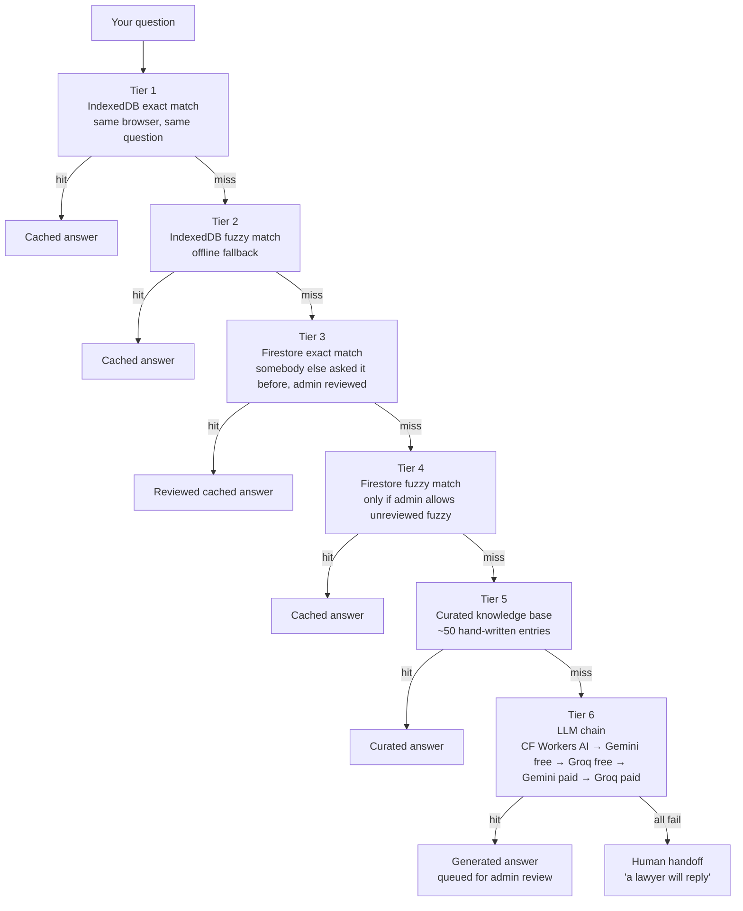

# AI legal assistant

The **AI legal assistant** is the floating chat button at the bottom-right of every page on [legaleaglelaws.com](https://legaleaglelaws.com). Click the button, type a question about Pakistani law in plain English, and get a structured answer in seconds. The assistant is designed for general, non-binding legal **information** — not advice tailored to your specific facts. Every answer ends with a "not legal advice" line and a CTA to [book a consultation](./free-consultation-booking.md) for a real opinion.

## What the assistant does well

- Explains **what a section of Pakistani law says** — for example, "what is Section 489-F PPC", "what does Section 22 of the Punjab Tenancy Act cover", "explain Article 199 of the Constitution".
- Answers **general procedural questions** — for example, "how does a bail application work in Pakistan", "what is the difference between a session court and a high court".
- Recalls **previously reviewed answers** instantly. If somebody else has asked a similar question and a firm administrator approved the cached answer, you get that exact answer back in milliseconds.
- Looks up an **advocate by name** in the Punjab Bar Council voter list (the *find-a-person* quick action).

## What the assistant does NOT do

- It is **not a substitute for a lawyer**. It cannot apply the law to your facts, draft a pleading, file a case, or guarantee an outcome.
- It does **not retrieve real-time court case status**. For hearing dates, ask the firm or use the practice-management tools (a SaaS lawyer can enable court-sync for their cases).
- It does **not give jurisdictional advice for non-Pakistan matters**. Ask about Pakistani law only.
- It does **not store or learn from your messages** to retrain a model. Cached answers are reviewed by humans before being served to other users.

## How the answer pipeline works

When you ask a question, the assistant tries six tiers in order. The first tier that returns a usable answer wins; the rest are skipped.

The first three tiers usually answer in **under 100 ms** — they're cache reads. Tier 5 (curated knowledge base) takes a similar fraction of a second. Tier 6 (LLM) typically takes 2–8 seconds depending on which provider in the chain answers. If every provider is rate-limited or down, the assistant queues the question for a human reply and tells you "a lawyer will reply" instead of guessing.

## Quick actions

Above the input box you'll see three chips:

### Find a person

Click **Find a person**, then type a name. The assistant tokenises the name, looks up matches in the Punjab Bar Council voter list, and returns up to 10 results with name, father/relation, and phone. This is a faster path to the same data the [public directory](./find-a-lawyer.md) shows, without leaving the chat. Counts against your daily *find-a-person* rate limit (see below).

### Search a section

Click **Search a section** and type something like "489-F PPC" or "Article 19 Constitution". The assistant uses a specialised system prompt that returns a structured answer:

- **Statute & section** — exact citation
- **What it covers** — scope
- **Key elements** — what must be proven
- **Punishment / consequence** — if applicable
- **Practical notes** — how it shows up in practice

Section searches use Cloudflare Workers AI only — they do **not** fall through to Gemini or Groq. If Cloudflare Workers AI is down, the section search returns a "temporarily unavailable" message rather than a less-grounded answer from a different provider.

### Just chat

The default — a free-form question. Goes through the full six-tier pipeline above.

## Rate limits

The assistant is free and the firm subsidises infrastructure costs. To keep it sustainable, daily limits apply (reset at UTC midnight):

| Audience | Cached / KB answers | LLM-generated answers | Find-a-person | Search-a-section |
|---|---|---|---|---|
| Anonymous (not signed in) | 100 / day | 10 / day | 100 / day | 10 / day |
| Signed in (firm client default) | 200 / day | 30 / day | 200 / day | 30 / day |
| Per-user override | configurable | configurable | configurable | configurable |
| Firm staff (admin) | unlimited | unlimited | unlimited | unlimited |

Per-user overrides are set by firm staff at `/admin/users` if a particular client legitimately needs more. You cannot raise your own limits.

If you hit the limit, the assistant tells you and suggests waiting until UTC midnight or [booking a consultation](./free-consultation-booking.md). The chat does not silently degrade — you always see why an answer didn't arrive.

## Use cases

### Quick definition before a meeting

You're about to walk into a court date and want to refresh on what Section 22 of the Punjab Tenancy Act actually says. Type the section, get the structured answer, walk in confident.

### Confirming a procedural step

Before filing an application, type "what does Section 22 of CPC require for return of plaint" — the curated KB answers in milliseconds, and you have the answer without flipping through statutes.

### Dipping a toe into a new area

You inherited a matter in an unfamiliar area of law. Ask the assistant a few opening questions to get a high-level orientation. Then [book a consultation](./free-consultation-booking.md) for the real deal.

### Explaining the law to a client

If you are a lawyer using the SaaS workspace and need to explain a section to a client, the structured "search a section" output is a good starting point — it's already formatted for layperson reading.

### Checking whether a name is on the bar voter list

The find-a-person action is the lowest-friction path into the [bar voter directory](./find-a-lawyer.md). Two clicks instead of three.

## Where the assistant runs

When you click Send, your question travels to a **Cloudflare Worker** sitting between your browser and the LLM providers. The worker:

- verifies your identity (signed-in users present a Firebase identity token; anonymous users present a stable client ID),
- enforces the daily rate limit (Firestore-backed counters),
- attempts the LLM chain (Workers AI → Gemini free → Groq free → Gemini paid → Groq paid),
- writes the question and answer to the cache so future readers get the same answer instantly.

This is why repeated questions are fast — they never reach an LLM provider after the first asker.

## Privacy

- Your question is sent to the LLM provider that answers it. Provider terms apply (Cloudflare Workers AI, Google Gemini, Groq).
- The platform's own logs strip the LLM provider's response and just record the question and a hashed identifier of the responder model.
- **Never paste the names, addresses, CNICs, or sensitive identifiers of real people into the assistant**, signed in or not. The assistant has no way to identify whether a question is hypothetical or real, and "real" identifiers travel through external LLM providers.
- The cache de-identifies queries when admins promote them to the public Q&A — the question is rephrased to remove personal details before being shown to other readers.

## Limitations

- **Not legal advice.** Every answer ends with a clear disclaimer. The assistant cannot apply the law to your specific facts.
- **Pakistani law focused.** Other jurisdictions are out of scope.
- **Statute snapshots, not live amendments.** If a section was amended last week, the assistant may not know yet. The curated knowledge base is refreshed periodically, but for the latest legislative state, check the official gazette.
- **No emotional support.** If your question is in distress about an abusive situation, the assistant will surface helpline contacts at the top of the answer — but it is not a counsellor. Please call the appropriate helpline.

## Frequently asked questions

### Is the assistant always going to give the same answer?

To the same exact question, signed in or not — yes, after the first asker's answer is cached. The firm reviews cached answers before they are served fuzzy-matched to *similar* questions.

### What if the assistant gives a wrong answer?

If you spot an error, message the firm at info@legaleaglelaws.com with the question and the answer. The cache entry can be edited or rejected. You can also ask the assistant the same question again — admin-rejected answers are not served the next time.

### Can I ask in Urdu?

You can try. The assistant works best in English, but most LLMs in the chain handle Urdu input. The structured "search a section" flow always returns English output for now.

### Why does it say "a lawyer will reply" sometimes?

That happens when every tier and every LLM provider in the chain failed — typically because the providers were rate-limited at that moment, or your question was outside the assistant's scope. Your question is queued in the firm's inbox; expect a human reply within office hours.

### Does the assistant know my case?

No. The assistant has no memory of past conversations and cannot access your firm-client dashboard. If you want context-aware help with your matter, [book a consultation](./free-consultation-booking.md).

### What models power tier 6?

The chain attempts, in order: Cloudflare Workers AI (free, on-network), Google Gemini Flash (free tier), Groq Llama (free tier), Gemini paid, Groq paid. The exact model within each provider may change as providers release updates. Whichever provider answers, the model name is recorded with the answer.

## Related pages

- [Find a lawyer](./find-a-lawyer.md) — the bar voter directory the find-a-person action uses.
- [Free consultation booking](./free-consultation-booking.md) — when you need a real opinion.
- [Help requests](../clients/help-requests.md) — the firm-client equivalent for ongoing matters.
